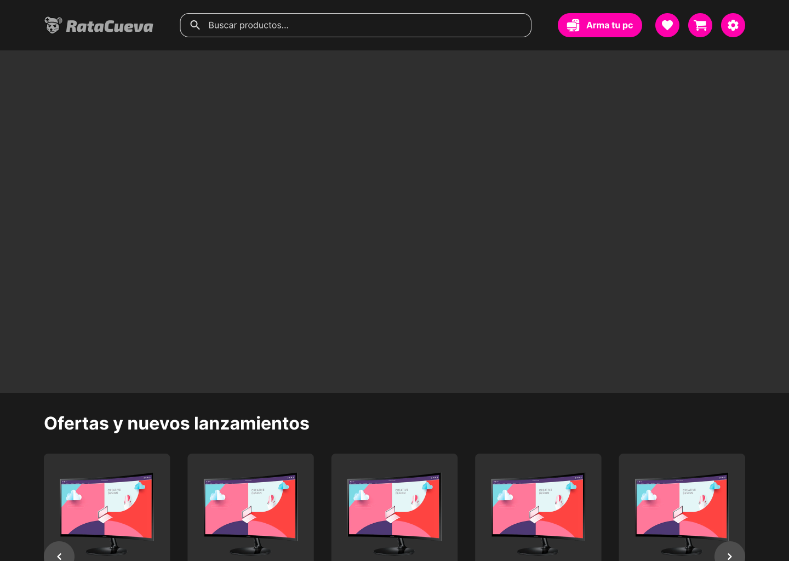
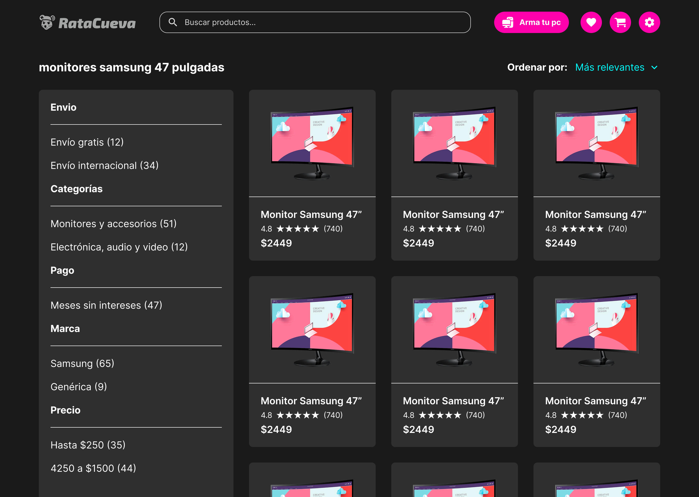
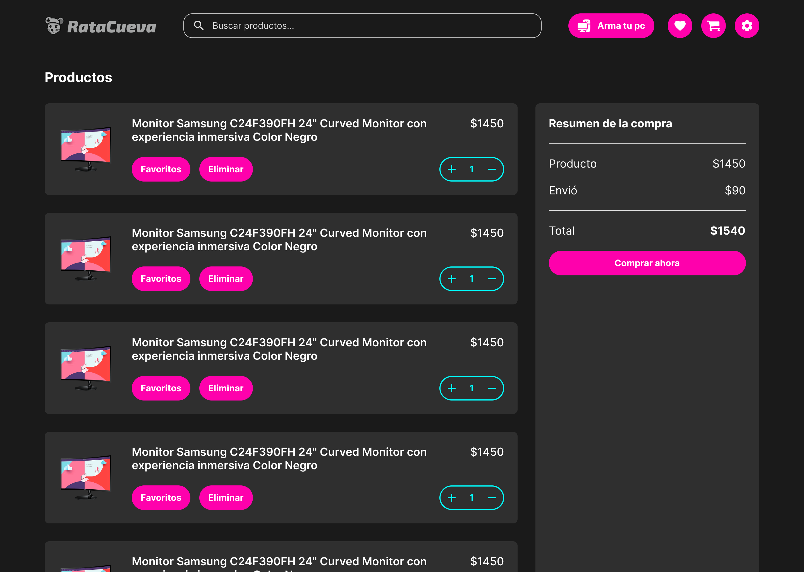
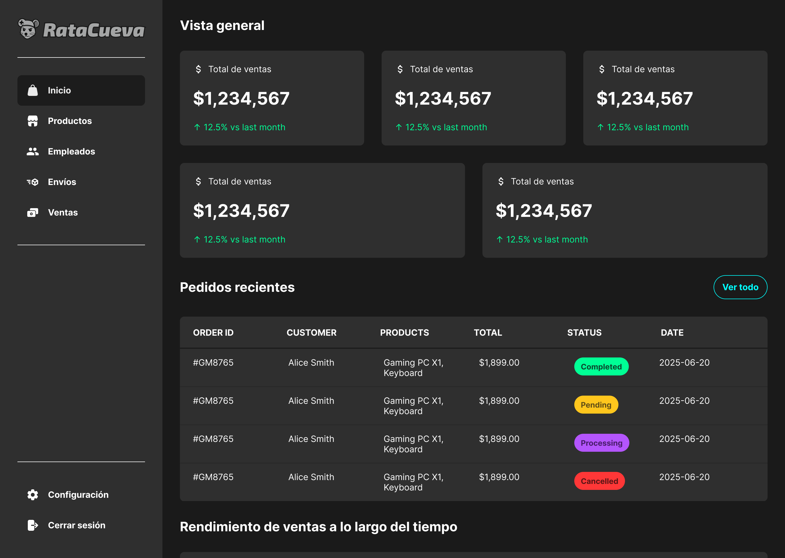

# RataCueva

Plataforma de ecommerce especializada en productos gaming: videojuegos, componentes de PC, equipos armados y accesorios para gamers.

<p align="center">
  
  
  
  
</p>

## 🖥️ Capturas de pantalla

<p align="center">
  
  
  
  
</p>

## 🎮 ¿Qué es RataCueva?

**RataCueva** es una plataforma integral de ecommerce gaming que incluye:

- **Tienda online** - catálogo completo de productos gaming
- **Panel administrativo** - gestión de inventario, ventas y envíos
- **Sistema de autenticación** - registro y login de usuarios
- **Carrito inteligente** - experiencia de compra optimizada

La plataforma ofrece desde **componentes de PC y periféricos** hasta **videojuegos y equipos completos**, proporcionando todo lo necesario para la comunidad gamer.

---

## ✨ Funcionalidades

🛒 **Catálogo completo** - videojuegos, componentes, PCs armadas y accesorios  
🔍 **Búsqueda avanzada** - filtros por categoría, precio y especificaciones  
🛡️ **Autenticación segura** - registro, login y recuperación de contraseña  
📱 **Diseño responsivo** - experiencia optimizada en todos los dispositivos  
📊 **Panel administrativo** - gestión de productos, empleados y ventas  
💳 **Carrito inteligente** - proceso de compra simplificado

---

## 🛠 Tecnologías

- **Next.js 15** con App Router
- **React 19** para interfaces interactivas
- **TypeScript** para desarrollo robusto
- **TailwindCSS 4** para estilos modernos
- **Framer Motion** para animaciones fluidas
- **React Query** para gestión de estado del servidor
- **Axios** para comunicación con APIs
- **React Table** para tablas de datos

---

## ⚡ Instalación rápida

### Prerrequisitos

- **Node.js** (v18 o superior)
- **npm** o **yarn**

### Pasos

1. **Clonar repositorio**

```bash
git clone https://github.com/chrisdev-ts/ratacueva-web.git
cd ratacueva-web
```

2. **Instalar dependencias**

```bash
npm install
```

3. **Configurar variables de entorno**
   Crea `.env.local` en la raíz:

```
NEXT_PUBLIC_API_URL="http://localhost:3001"
DATABASE_URL="tu_database_url"
NEXTAUTH_SECRET="tu_secret_key"
```

4. **Ejecutar en desarrollo**

```bash
npm run dev
```

La aplicación estará disponible en `http://localhost:3000`

---

## 🏗 Estructura del proyecto

```
src/
├── app/                    # App Router de Next.js
│   ├── (auth)/            # Rutas de autenticación
│   ├── (dashboard)/       # Panel administrativo
│   └── (shop)/            # Tienda online
├── components/            # Componentes reutilizables
│   ├── atoms/             # Componentes básicos
│   ├── features/          # Componentes por funcionalidad
│   └── organisms/         # Componentes complejos
├── hooks/                 # Hooks personalizados
├── services/              # Servicios de API
└── contexts/              # Contextos de React
```

---

## 🏗 Ecosistema RataCueva: nuestros repositorios

RataCueva está compuesto por múltiples repositorios especializados:

| Repositorio                                                      | Propósito                | Estado           |
| ---------------------------------------------------------------- | ------------------------ | ---------------- |
| **ratacueva-web**                                                | Frontend ecommerce       | ✅ En desarrollo |
| **[ratacueva-api](https://github.com/styleEddie/ratacueva-api)** | API backend principal    | ✅ En desarrollo |
| **ratacueva-mobile**                                             | App móvil nativa         | 🚧 Planificado   |
| **ratacueva-payments**                                           | Microservicio de pagos   | 🚧 Planificado   |

---

## 🤝 Colaboración interna

Seguimos convenciones específicas para mantener consistencia - consulta [CONTRIBUTING.md](CONTRIBUTING.md) y [INTERFACES.md](INTERFACES.md) para conocer nuestras convenciones de desarrollo y estructura de datos.

## 📝 Licencia

Este proyecto está bajo la licencia MIT. Consulta el archivo LICENSE para más detalles.
